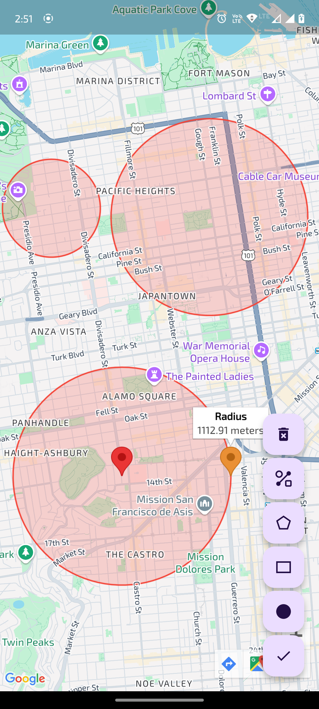
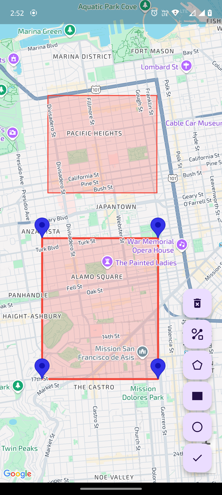
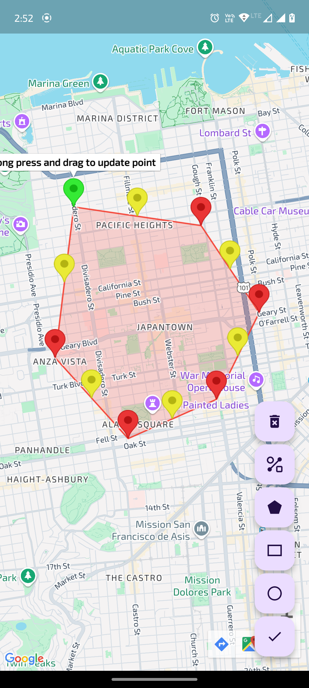
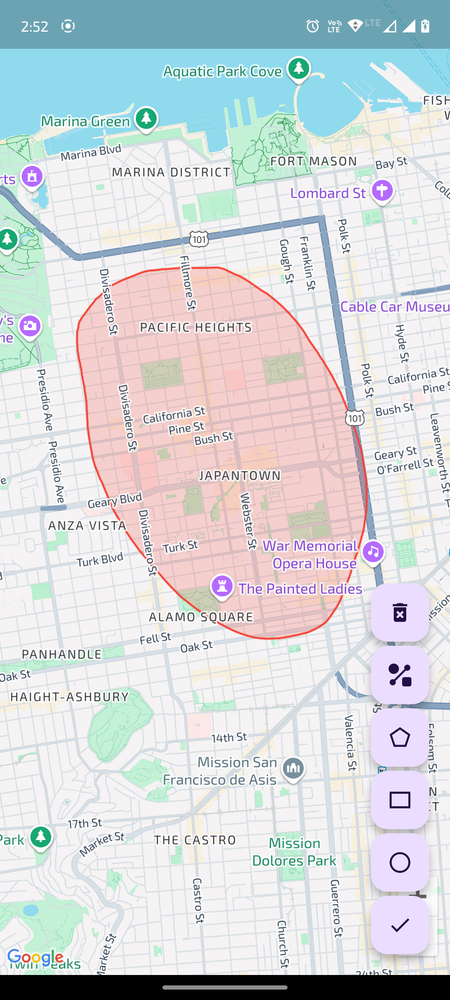

# 🗺️ google_maps_drawing_tools

A powerful Flutter package that brings advanced drawing tools to Google Maps.  
With support for polygons, rectangles, and circles, it enables interactive drawing, editing, and customization directly on the map.  
Ideal for applications involving geofencing, region selection, and spatial data visualization.

---

## ✨ Features

- **Interactive Drawing**: Draw polygons, rectangles, and circles directly on the map with intuitive gestures.
- **Editing Capabilities**: Modify shapes by dragging vertices or edges.
- **Customizable Styles**: Adjust stroke and fill colors, opacity, and other styling options.
- **Selection & Deletion**: Tap to select shapes and remove them as needed.
- **Event Callbacks**: Hook into drawing and editing events for custom behaviors.
- **Modular Architecture**: Clean codebase designed for easy integration and extension.

---

## 📦 Installation

Add the package to your `pubspec.yaml`:

```yaml
dependencies:
  google_maps_drawing_tools:
    git:
      url: https://github.com/ExploreAritra/google_maps_drawing_tools.git
      ref: dev
```

Then, run:

```bash
flutter pub get
```

---

## 🛠️ Usage

### 1. Initialize the Drawing Controller

```dart
final drawingController = DrawingController();
```

### 2. Integrate with GoogleMap Widget

```dart
GoogleMap(
  onMapCreated: (GoogleMapController controller) {
    drawingController.setMapController(controller);
  },
  markers: drawingController.markers,
  polygons: drawingController.polygons,
  circles: drawingController.circles,
  onTap: drawingController.onMapTap,
  onLongPress: drawingController.onMapLongPress,
  // ... other map properties
)
```

### 3. Start Drawing

```dart
// To start drawing a polygon
drawingController.startDrawing(DrawMode.polygon);

// To start drawing a rectangle
drawingController.startDrawing(DrawMode.rectangle);

// To start drawing a circle
drawingController.startDrawing(DrawMode.circle);
```

### 4. Finish Drawing

```dart
drawingController.finishDrawing();
```

### 5. Update Shape Color

```dart
drawingController.updateColor(shapeId, newColor);
```

### 6. Delete a Shape

```dart
drawingController.deleteShape(shapeId);
```

---

## 📸 Screenshots







---

## 🧪 Example

An example application demonstrating the package's capabilities is available in the `example/` directory.

To run it:

```bash
cd example
flutter run
```

---

## 📄 License

This project is licensed under the MIT License. See the [LICENSE](https://github.com/ExploreAritra/google_maps_drawing_tools/blob/dev/LICENSE) file for details.

---

## 🙌 Contributions

Contributions are welcome!  
Feel free to submit issues or pull requests to enhance the package.

---

For more details and updates, visit the [google_maps_drawing_tools GitHub repository](https://github.com/ExploreAritra/google_maps_drawing_tools/tree/dev).